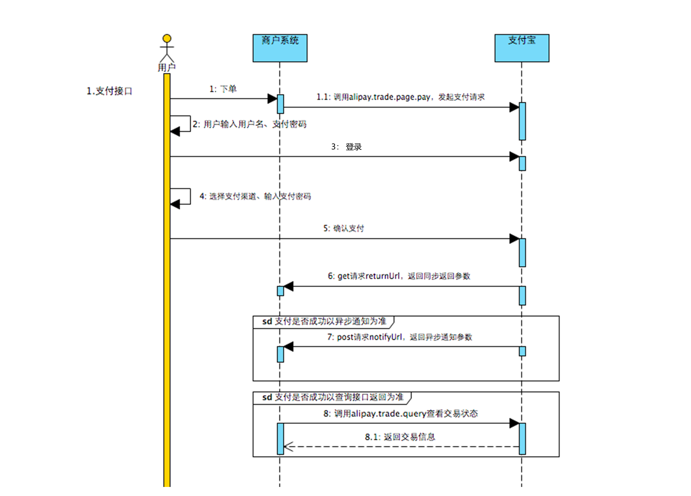

# 注意
支付宝所有的支付方法和场景都在`https://opendoc.alipay.com/open/00a0ut`，此demo使用的电脑网站支付，其余场景同理

# 初始
1. 进入`https://open.alipay.com/`
2. 拉到下面，选择`网页/移动开发`
3. 选择`开发工具`->`API集成工具`->`沙箱环境`
4. 按照步骤，进入`开发平台控制台`->`开发工具推荐`->`沙箱`
5. 选择`系统默认密钥`->`启用公钥模式`，然后设置授权回调地址（就是下面notifyURL，要使用内网穿透）
6. 选择`沙箱账号`->设置一下金额，记录下用户账号和支付密码

# 发起交易
根据支付宝的接口文件可见：

1. **发起网页端的交易申请**要访问`alipay.trade.page.pay`，正好对应了gopay里面的`alipay.TragePagePay`方法
   * 设置subject、out_trade_no、total_amount、product_code(这个默认是`FAST_INSTANT_TRADE_PAY`)
2. returnUrl是同步返回接口的url，传过来的参数见`https://opendocs.alipay.com/open/028r8t`中的公共响应参数和响应参数
   * 同步返回接口，**必须是get方法**，作为参数传递给支付宝，由支付宝在支付后调用跳转
   * **用户付款成功后，从支付宝跳转到这个页面**
   * 在这个页面中加入相关业务处理，比如更新记录，标记付款成功信息。
   * **需要对支付宝传递过来的签名进行认证。**
   * 用来展现成功付款信息给前台付款用户。
   * **支付宝那边只返回一次。**
   * **由于用户在付款完成后，直接关闭付款页面，不跳转到return_url的页面，会导致return_url的相关业务处理不了。**
3. notify_url是异步返回接口的url，传过来的参数同returnurl
   * 异步通知接口，必须是post方法，作为参数传递给支付宝，支付宝会在支付后访问。
   * 如果不传递，则不通知。
   * 相关业务逻辑应该和return_url中相同。
   * 返回字符串”success”或者”fail”，不能带有任何HTML信息。
   * 付款成功后就通知一次，如果不成功，1分钟、3分钟、10分钟、半个小时。。。后再通知，直到返回success。
   * 过期时间是48小时，如果48小时内都通知不成功，那么就不再通知。
4. 可以通过`alipay.trade.query`查询，对应gopay里面的`alipay.TrageQuery`方法

# 查询交易
调用alipay.TradeQuery，对应alipay.trade.query。

# todo: 退款及查询退款、关闭及查询关闭测试